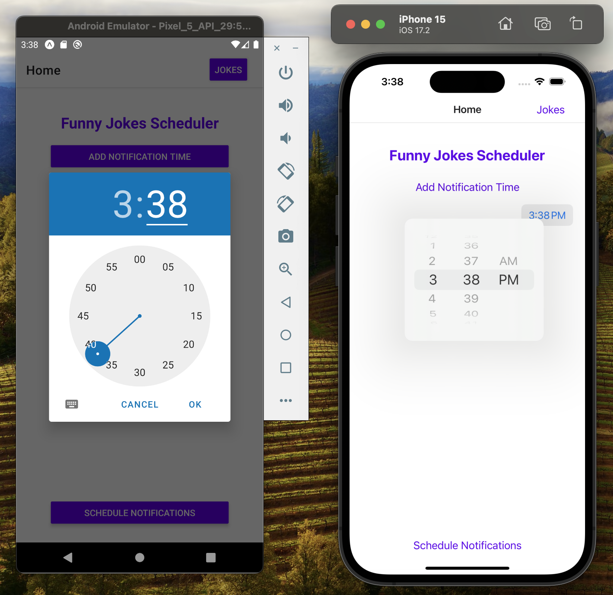
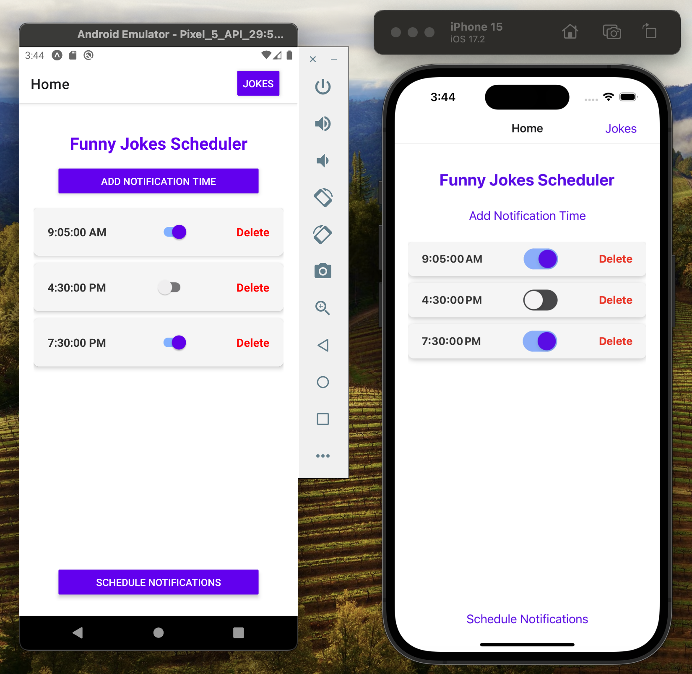
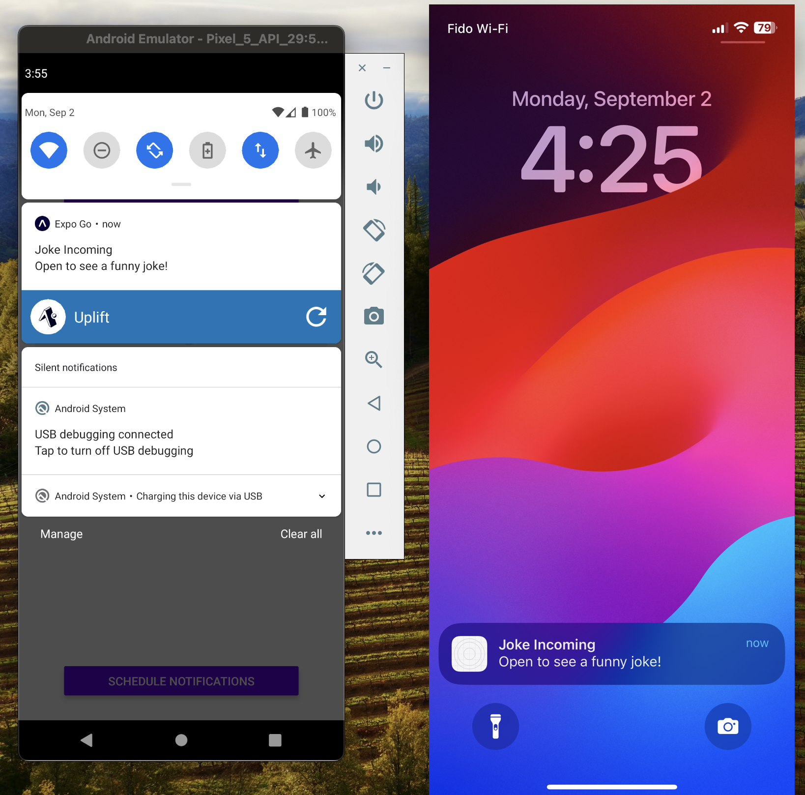
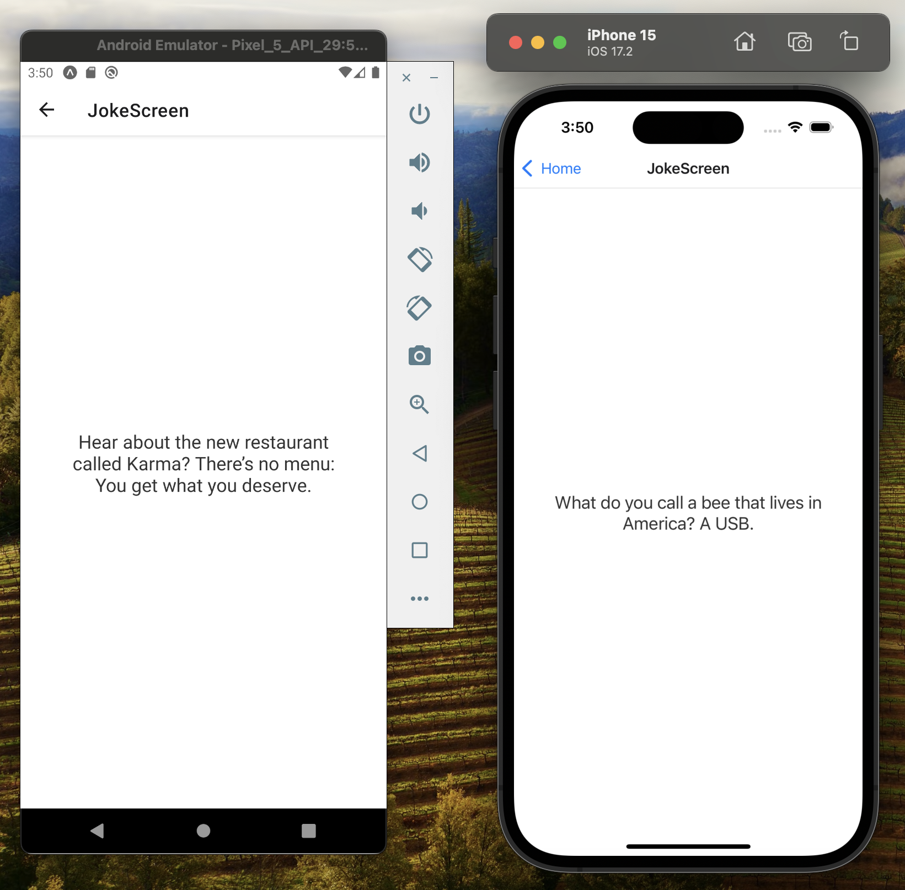

# UPLIFT - React Native Cross-Platform Mobile App for Motivational Quotes Notifications

This app is designed using React Native to deliver daily motivational quotes as notifications on both Android and iOS platforms. Users can set specific times to receive notifications, ensuring they get a boost of motivation throughout the day. The app allows for the customization of notification times and includes options to enable or disable these notifications as needed.

## Screenshots

|                Adding schedule                 |            List of scheduled jokes             |
| :--------------------------------------------: | :--------------------------------------------: |
|  |  |

|                  Joke notification                   |             Joke viewer Screen              |
| :--------------------------------------------------: | :-----------------------------------------: |
|  |  |

## Key Features

- **Daily Motivational Quotes:** Users receive daily quotes to inspire and motivate them.
- **Customizable Notification Times:** Users can set and manage multiple notification times throughout the day.
- **Cross-Platform Compatibility:** Seamless experience on both Android and iOS devices.
- **Background Notifications:** Notifications are sent even when the app is not in use, ensuring consistent motivation.

## Technologies Used

- **React Native:** For building the app across Android and iOS platforms.
- **TypeScript:** For enhancing code quality, maintainability, and development efficiency.
- **Expo SDK:** To simplify development and ensure compatibility across devices.
